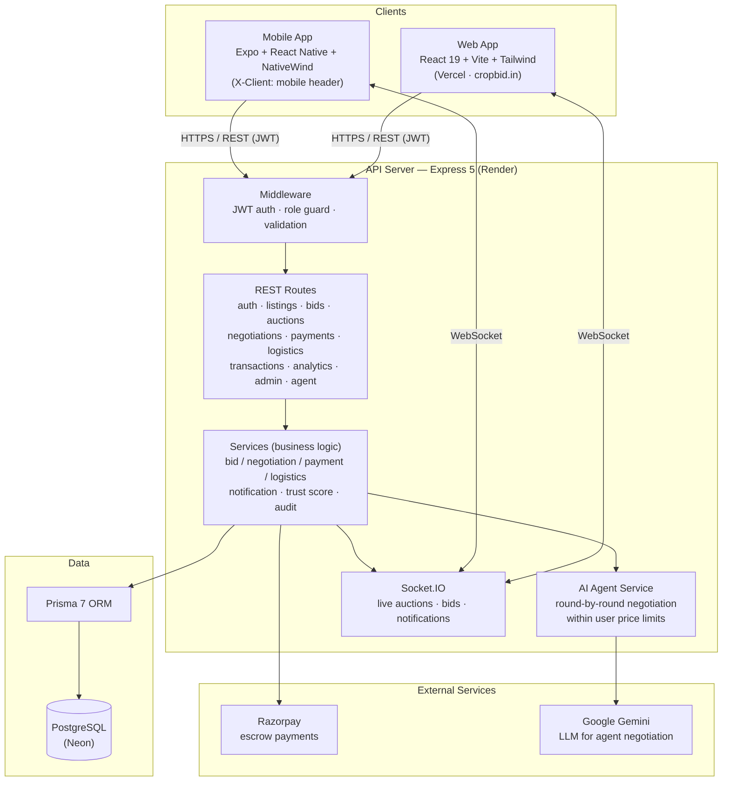
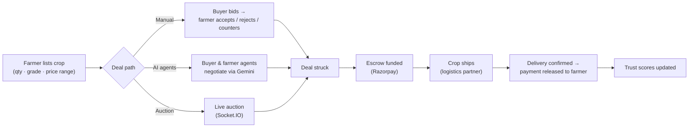

# CropBid — System Block Diagram

High-level architecture of the CropBid platform: clients, API server, real-time layer, data store, and external services.

## Block diagram (Mermaid)

## Deal flow (domain view)

## Component summary

| Block | Tech | Hosting |
|---|---|---|
| Web client | React 19, Vite, Tailwind | Vercel (cropbid.in) |
| Mobile client | Expo, React Native, NativeWind | — |
| API server | Express 5, TypeScript | Render |
| Real-time | Socket.IO | Render (same process) |
| ORM / DB | Prisma 7 → PostgreSQL | Neon |
| Payments | Razorpay (escrow) | external |
| AI negotiation | Google Gemini | external |
